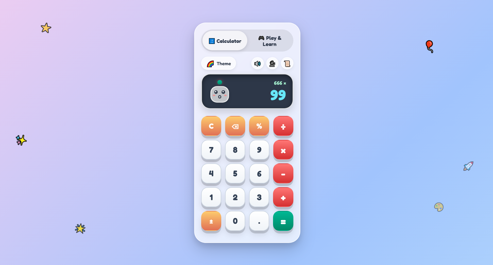
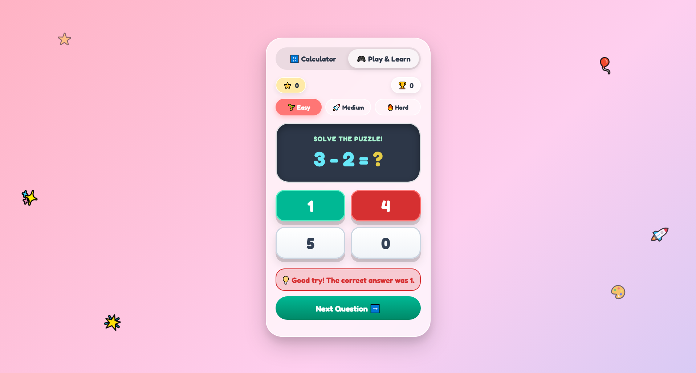

# 🧮 KidsCalc

> 🎮 An interactive and fun learning calculator built for kids with **music, questions, hints, puzzles, and playful UI**.

KidsCalc is an educational web application designed to make learning mathematics more enjoyable for children. Instead of being just a calculator, the project combines **calculation, quizzes, puzzles, hints, sounds, and interactive challenges** into one kid-friendly experience.

Built with **Angular 21** and designed with a colorful, playful interface.

---

## ✨ Features

* 🧮 **Interactive Calculator** — Simple and kid-friendly calculator experience
* 🧩 **Math Puzzles** — Fun challenges designed to improve problem-solving
* ❓ **Questions & Quizzes** — Interactive math questions for kids
* 💡 **Hints** — Helpful hints when kids get stuck
* 🎵 **Background Music & Sounds** — Makes learning more engaging
* 🏆 **Interactive Learning** — Encourages kids to solve problems and keep learning
* 🎨 **Kid-Friendly UI** — Colorful and playful interface
* 📱 **Responsive Design** — Works across desktop, tablet, and mobile screens

---

## 📸 Screenshots

### 🧮 Kids Calculator



### 🧩 Kids Puzzle



---

## 🎮 How It Works

KidsCalc combines several learning activities into one simple experience:

```text
          🎮 KidsCalc
              │
      ┌───────┼────────┐
      │       │        │
   🧮 Calc  🧩 Puzzle  ❓ Quiz
      │       │        │
      └───────┼────────┘
              │
        💡 Hints & Help
              │
        🎵 Music & Sound
              │
         🏆 Keep Learning
```

Kids can practice calculations, answer questions, solve puzzles, and use hints whenever they need help.

---

## 🛠️ Tech Stack

| Technology     | Purpose                     |
| -------------- | --------------------------- |
| 🅰️ Angular 21 | Frontend framework          |
| TypeScript     | Application logic           |
| HTML5          | Structure                   |
| SCSS / CSS     | Styling & animations        |
| Angular CLI    | Development & build tooling |
| Vitest         | Unit testing                |

---

## 🚀 Getting Started

### 1. Clone the repository

```bash
git clone https://github.com/your-username/KidsCalc.git
```

### 2. Navigate to the project

```bash
cd KidsCalc
```

### 3. Install dependencies

```bash
npm install
```

### 4. Start the development server

```bash
ng serve
```

Open your browser and visit:

```text
http://localhost:4200/
```

The application automatically reloads whenever source files are modified.

---

## 📦 Build

Create a production build with:

```bash
ng build
```

The compiled application will be stored in the `dist/` directory.

---

## 🧪 Testing

Run unit tests with:

```bash
ng test
```

The project uses **Vitest** as its testing framework.

For end-to-end testing:

```bash
ng e2e
```

Angular CLI does not include an end-to-end testing framework by default, so an appropriate framework can be added if required.

---

## 📁 Project Structure

```text
KidsCalc/
│
├── src/
│   ├── app/
│   │   ├── components/
│   │   ├── pages/
│   │   ├── services/
│   │   └── ...
│   │
│   ├── assets/
│   └── styles.scss
│
├── screenshots/
│   ├── calculator.png
│   └── puzzle.png
│
├── angular.json
├── package.json
└── README.md
```

---

## 🎯 Project Goals

KidsCalc was created with the idea of turning mathematics practice into something **interactive rather than boring**.

The project focuses on:

* 🧠 Improving basic math skills
* 🧩 Developing problem-solving abilities
* 💡 Helping children learn through hints
* 🎵 Making practice more engaging through sound
* 🎮 Creating a game-like learning experience
* 📱 Building a modern responsive Angular application

---

## 🔮 Future Improvements

* ⭐ Score and reward system
* 🏅 Achievements and badges
* 👤 Kids' profiles
* 📊 Learning progress dashboard
* 🎚️ Difficulty levels
* ⏱️ Timed challenges
* 🧩 More puzzle types
* 🎵 Additional sound effects and music
* 🌙 Dark mode
* 🌍 Multiple languages
* 🏆 Leaderboard

---

## 💻 Development

Generate a new Angular component:

```bash
ng generate component component-name
```

For a complete list of Angular CLI commands:

```bash
ng generate --help
```

---

## 📚 Resources

* [Angular Documentation](https://angular.dev/)
* [Angular CLI Documentation](https://angular.dev/tools/cli)
* [Vitest Documentation](https://vitest.dev/)

---

## 👨‍💻 Author

**Usama Ali**

Built with ❤️ using Angular and a passion for creating interactive web experiences.

---

⭐ **If you like KidsCalc, consider giving the repository a star!**
